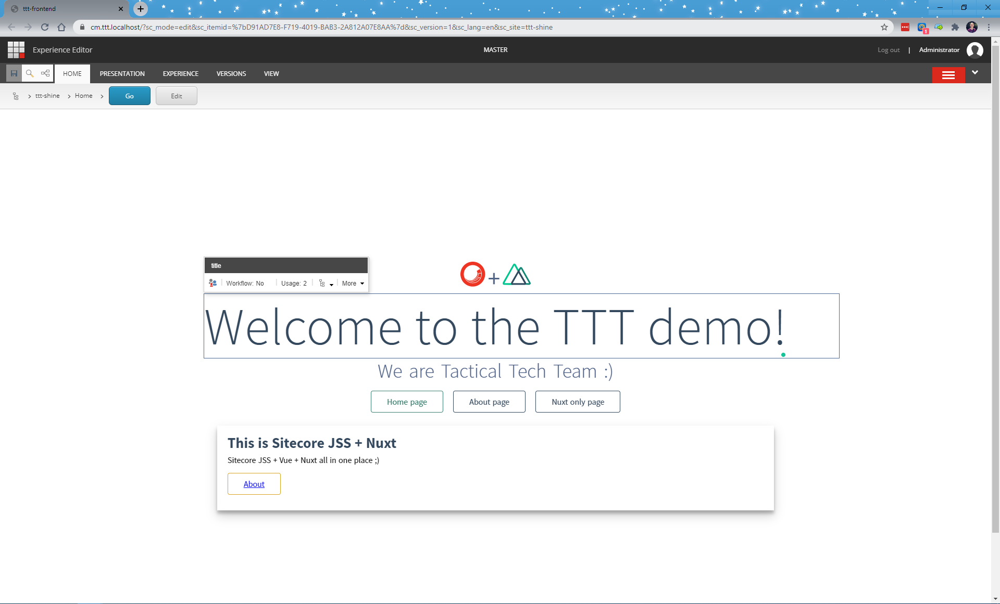

# Sitecore Hackathon 2021

# Hackathon Submission Entry form

## Team name
Tactical Tech Team

## Project name
**S** - Sitecore

**H** - Headless

**I** - Inconceivable

**N** - Nuxt

**E** - Experience

## Category
Best use of headless using JSS or .NET

## Description
A local development headless installation of sitecore plus NuxtJS frontend experience together with fully separated frontend and backend systems:
  - Module Purpose:
    - Introduce NuxtJS to Sitecore headless solution
    - Fully separate Sitecore backend and frontend solutions
    - Containerize development(higher environments QA, UAT will be added in the future as well as K8s support) setup out of the box
    - Separate server for EE rendering
    - Ability to work in disconnected mode on FE side
    - FE and BE could be split into two repositories to have full independence in the team, that was done as one repo due to hackaton limitation
  - What problem was solved (if any)
    - NuxtJS support for Sitecore solutions
    - Improved development flow for the backend and frontend teams by removing necessity of integrated mode.
    - Use NUXT possibility to render the same page with GET (end-user) and POST (Experience Editor) requests. With this approach, we can have the flexibility of choosing different layouts for different pages, just create a new one in frontend/pages/ 🙌
    - We had fun
    - Multiple pizzas eaten
  - Solution diagram 
  - Experience Editor 
  - Front end 
  - Front end disconnected mode 
## Video link
⟹ Video is available here - https://youtu.be/gxGO8lveurY

## Pre-requisites and Dependencies
- Visual Studio 2019
- NodeJS v14.14
- Docker

## Installation instructions
- `cd .\frontend`  
- `npm install`
 
- Visual Studio -> Build Solution
- `Environment Website` project -> right click -> Publish
- check that folder `.\docker\deploy\platform\` is populated
- Start docker environment using `.\Start-Hackathon.ps1`
- after sitecore site has started, sync Unicorn via `https://cm.ttt.localhost/unicorn.aspx`, sitecore credentials usr:admin pwd:b
- Once Sync is done, please do full publish

### Configuration
> If you want to run solution in the disconnected mode, please change `isDisconnected` to `true` in `.\frontend\env.js` file.
> If frontend only is needed, then execute `npm run dev` to make sure that FE application is fully working in disconnected mode.

## Usage instructions
Open Sitecore, find `ttt-shine` site and open `Home` in EE you should get usual content editing experience, but EE rendering was done on separate ee renderer server.
You could override ee renderer for the different one by adding `?sc_httprenderengineurl=https://feature-branch-name-ee.ttt.localhost`, it is handy when newer FE branch is deployed somewhere in the K8s and you want to test it against this new version of the FE site and EE renderer.

Open `http://fe.ttt.localhost` - one docker container is used by both Experience Editor and FE in SSR and SPA mode.

